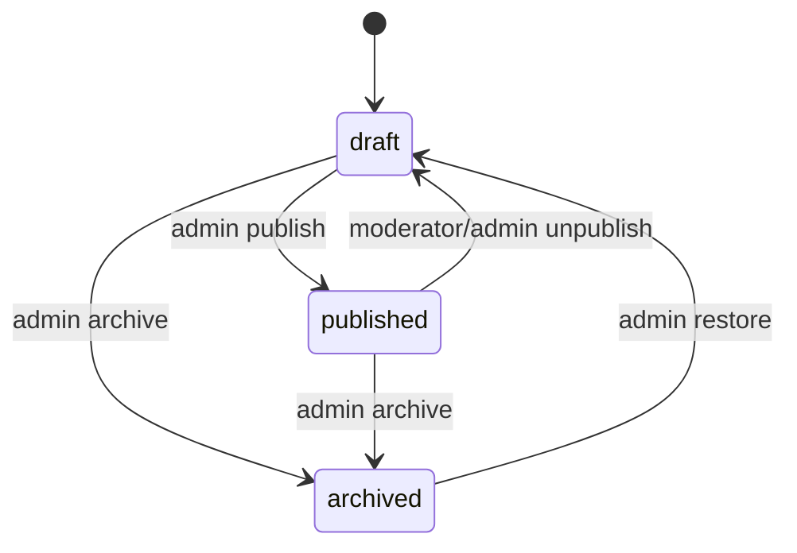

# Music Group Store API: полная инструкция

Документ описывает фактический HTTP-контракт backend: запуск, авторизацию,
роли, все группы маршрутов, форматы запросов, работу с файлами и типовые ошибки.
Интерактивная схема всегда доступна в Swagger и считается источником актуальных
типов.

## 1. Адреса и общие правила

Локальный адрес API:

```text
http://localhost:8000
```

Служебные страницы:

| Адрес | Назначение |
| --- | --- |
| `/docs` | Swagger UI: просмотр и ручной вызов маршрутов |
| `/redoc` | ReDoc |
| `/openapi.json` | OpenAPI-схема для генерации клиента и типов |
| `/health/live` | процесс API запущен |
| `/health/ready` | API видит PostgreSQL и Redis |

Все бизнес-маршруты начинаются с `/api/v1`. JSON-запросы отправляются с
`Content-Type: application/json`. Загрузки используют `multipart/form-data`.

UUID передаются строками стандартного вида:

```text
550e8400-e29b-41d4-a716-446655440000
```

### Основные заголовки

| Заголовок | Где используется | Пример |
| --- | --- | --- |
| `Authorization` | защищённые маршруты | `Bearer eyJ...` |
| `Accept-Language` | локализованные ответы | `en`, `lv`, `ru` |
| `Range` | частичная отдача audio/video | `bytes=0-1048575` |
| `Content-Type` | формат тела запроса | `application/json` |

Для каталога берутся первые два символа `Accept-Language`. Music API понимает
`en`, `lv`, `ru`, региональные варианты вроде `ru-RU` и при неизвестном языке
использует английский.

URL файлов в JSON могут быть относительными. Если frontend и API находятся на
разных origin, frontend добавляет origin API:

```js
const absoluteMediaUrl = new URL(asset.url, API_ORIGIN).toString();
```

## 2. Локальный запуск

Создать локальное окружение:

```powershell
Copy-Item .env.example .env
```

Запустить Docker Compose с локальными bind mounts и открытыми портами БД/Redis:

```powershell
docker compose -f docker-compose.yml -f docker-compose.dev.yml up -d --build
```

API автоматически выполняет `alembic upgrade head` перед запуском FastAPI.
Проверка:

```powershell
docker compose exec api uv run alembic current
curl.exe http://localhost:8000/health/live
curl.exe http://localhost:8000/health/ready
```

Ожидаемая миграция:

```text
9a7d3c2e1f40 (head)
```

### Первый администратор

Перед созданием администратора заменить в `.env`:

```dotenv
FIRST_ADMIN_EMAIL=owner@example.com
FIRST_ADMIN_PASSWORD=длинный-не-шаблонный-пароль
```

Затем выполнить:

```powershell
docker compose exec api uv run python seed.py
```

`seed.py` создаёт администратора, только если в базе ещё нет ни одного
пользователя с ролью `admin`. Пароль должен содержать минимум 12 символов.

## 3. Авторизация и роли

В системе две внутренние роли:

| Роль | Возможности |
| --- | --- |
| `moderator` | контент каталога, UI-переводы, draft-музыка, загрузка файлов, unpublish |
| `admin` | всё доступное moderator плюс пользователи, публикация и lifecycle музыки, удаление переводов и категорий |

Публичные посетители видят опубликованные товары, треки и клипы, категории и
публичные локализации.

### Получение JWT

```http
POST /api/v1/auth/token
Content-Type: application/x-www-form-urlencoded

username=owner@example.com&password=secret
```

Пример `curl`:

```bash
curl -X POST http://localhost:8000/api/v1/auth/token \
  -H "Content-Type: application/x-www-form-urlencoded" \
  --data-urlencode "username=owner@example.com" \
  --data-urlencode "password=secret"
```

Ответ:

```json
{
  "access_token": "eyJ...",
  "token_type": "bearer"
}
```

Во все защищённые запросы передаётся:

```http
Authorization: Bearer eyJ...
```

Срок жизни токена задаёт `ACCESS_TOKEN_EXPIRE_MINUTES`, по умолчанию 30 минут.
Refresh token отсутствует: после истечения срока нужно снова вызвать `/auth/token`.

После пяти неудачных попыток с одной пары IP/email вход блокируется на 300
секунд. Значения меняются через `AUTH_RATE_LIMIT_ATTEMPTS` и
`AUTH_RATE_LIMIT_WINDOW_SECONDS`. Успешный вход сбрасывает счётчик.

## 4. Статусы и ошибки

| HTTP | Значение |
| ---: | --- |
| `200` | запрос выполнен |
| `201` | ресурс создан |
| `204` | удаление выполнено, тела ответа нет |
| `206` | возвращён диапазон audio/video |
| `400` | неправильное действие или переход состояния |
| `401` | токен отсутствует, неверен или истёк |
| `403` | роли недостаточно |
| `404` | ресурс отсутствует или скрыт от публичного API |
| `409` | конфликт данных или ресурс ещё не готов к публикации |
| `413` | файл превышает лимит |
| `415` | неподдерживаемый формат/MIME/codec |
| `422` | ошибка схемы запроса или содержимого файла |
| `429` | превышен лимит попыток входа |
| `503` | PostgreSQL или Redis не готовы |

Music API возвращает контролируемые ошибки в едином формате:

```json
{
  "detail": {
    "code": "TRACK_AUDIO_REQUIRED",
    "message": "Upload a valid audio file before publishing the track.",
    "field": "audio"
  }
}
```

Frontend должен принимать решения по `detail.code`, а `message` использовать
как fallback-текст. Ошибки валидации FastAPI имеют стандартный массив
`detail[]` с `loc`, `msg` и `type`.

## 5. System API

| Метод | Маршрут | Доступ | Результат |
| --- | --- | --- | --- |
| GET | `/health/live` | публичный | `{"status":"alive"}` |
| GET | `/health/ready` | публичный | `{"status":"ready"}` либо `503` |

`live` проверяет только процесс приложения. `ready` выполняет запрос к
PostgreSQL и `PING` Redis.

## 6. Users API

### Маршруты

| Метод | Маршрут | Доступ | Назначение |
| --- | --- | --- | --- |
| POST | `/api/v1/users/` | admin | создать пользователя |
| GET | `/api/v1/users/` | admin | список, query `limit` и `offset` |
| GET | `/api/v1/users/me` | любой JWT | текущий пользователь |
| PATCH | `/api/v1/users/{user_id}` | admin | изменить пользователя |

Удаление пользователей отдельным маршрутом не предусмотрено. Для блокировки
используется `is_active: false`.

### Создание пользователя

```json
{
  "email": "moderator@example.com",
  "password": "at-least-8-characters",
  "role": "moderator",
  "is_active": true
}
```

`role` принимает только `admin` или `moderator`. Email уникален, минимальная
длина пароля — 8 символов.

Пример ответа:

```json
{
  "id": "uuid",
  "email": "moderator@example.com",
  "role": "moderator",
  "is_active": true,
  "created_at": "2026-07-19T12:00:00",
  "updated_at": "2026-07-19T12:00:00"
}
```

### Обновление пользователя

PATCH принимает только переданные поля:

```json
{
  "role": "admin",
  "is_active": true
}
```

Можно отдельно изменить `email`, `role`, `is_active` или `password`. Пароль в
ответах никогда не возвращается.

## 7. Catalog API

Каталог состоит из дерева категорий, товаров и изображений. Названия категорий,
названия и описания товаров сохраняются на `en`, `lv`, `ru`. Публичный ответ
содержит только локализованные поля `title`/`description` для выбранного языка.

### Категории

| Метод | Маршрут | Доступ | Назначение |
| --- | --- | --- | --- |
| GET | `/api/v1/catalog/categories` | публичный | все категории |
| GET | `/api/v1/catalog/categories/{category_id}` | публичный | одна категория |
| POST | `/api/v1/catalog/categories` | moderator/admin | создать |
| PATCH | `/api/v1/catalog/categories/{category_id}` | admin | изменить |
| DELETE | `/api/v1/catalog/categories/{category_id}` | admin | удалить |

Создание корневой категории:

```json
{
  "slug": "vinyl",
  "parent_id": null,
  "title_en": "Vinyl",
  "title_lv": "Vinils",
  "title_ru": "Винил"
}
```

Для подкатегории `parent_id` содержит UUID родителя. Backend рассчитывает
`level`. В PATCH можно передать `parent_id: null`, чтобы перенести категорию в
корень. Категорию нельзя удалить, пока у неё есть подкатегории или товары.

Ответ зависит от `Accept-Language`:

```json
{
  "id": "uuid",
  "parent_id": null,
  "slug": "vinyl",
  "level": 0,
  "title": "Винил",
  "created_at": "2026-07-19T12:00:00",
  "updated_at": "2026-07-19T12:00:00"
}
```

### Товары

| Метод | Маршрут | Доступ | Назначение |
| --- | --- | --- | --- |
| GET | `/api/v1/catalog/products` | публичный | только опубликованные товары |
| GET | `/api/v1/catalog/products/{product_id}` | публичный | опубликованный товар либо 404 |
| GET | `/api/v1/catalog/manage/products` | moderator/admin | все товары; `only_published=false` |
| GET | `/api/v1/catalog/manage/products/{product_id}` | moderator/admin | товар независимо от публикации |
| POST | `/api/v1/catalog/products` | moderator/admin | создать товар |
| PATCH | `/api/v1/catalog/products/{product_id}` | moderator/admin | изменить товар |
| DELETE | `/api/v1/catalog/products/{product_id}` | moderator/admin | удалить товар |

Создание:

```json
{
  "slug": "black-t-shirt",
  "category_id": "uuid",
  "is_published": false,
  "in_stock": true,
  "title_en": "Black T-shirt",
  "title_lv": "Melns T-krekls",
  "title_ru": "Чёрная футболка",
  "description_en": "Description",
  "description_lv": "Apraksts",
  "description_ru": "Описание"
}
```

PATCH принимает любое подмножество полей:

```json
{
  "is_published": true,
  "in_stock": true,
  "title_ru": "Новое название"
}
```

Публичный detail намеренно возвращает 404 для неопубликованного товара. Для
редактирования draft нужно использовать `/catalog/manage/products/{id}`.

### Изображения товаров

| Метод | Маршрут | Доступ | Назначение |
| --- | --- | --- | --- |
| POST | `/api/v1/catalog/products/{product_id}/images` | moderator/admin | загрузить изображение |
| PATCH | `/api/v1/catalog/products/{product_id}/images/{image_id}/main` | moderator/admin | назначить главным |
| DELETE | `/api/v1/catalog/images/{image_id}` | moderator/admin | удалить |

Загрузка — `multipart/form-data`:

| Поле | Тип | Обязательное | Значение по умолчанию |
| --- | --- | --- | --- |
| `file` | binary | да | — |
| `is_main` | boolean | нет | `false` |
| `sort_order` | integer | нет | `0` |

```bash
curl -X POST http://localhost:8000/api/v1/catalog/products/PRODUCT_ID/images \
  -H "Authorization: Bearer TOKEN" \
  -F "file=@cover.webp;type=image/webp" \
  -F "is_main=true" \
  -F "sort_order=0"
```

Поддерживаются JPEG, PNG, WebP до 5 MB. Backend проверяет реальное содержимое
через Pillow. URL вида `/uploads/products/{filename}` публичный. Если основное
изображение не задано, первое изображение автоматически становится главным.

## 8. Localization API

Localization API предназначен прежде всего для UI-текстов. Переводы доменных
сущностей `product`, `category`, `music_track`, `music_clip` нельзя менять через
общий CRUD — они управляются через Catalog/Music API.

### Публичное чтение

| Метод | Маршрут | Результат |
| --- | --- | --- |
| GET | `/api/v1/localization/flat/{entity_type}/{entity_id}` | плоский объект ключ-значение |
| GET | `/api/v1/localization/bundle/{entity_type}` | все entity данного типа, сгруппированные по ID |
| GET | `/api/v1/localization/translations/{translation_id}` | одна запись перевода |

```http
GET /api/v1/localization/flat/ui/header
Accept-Language: ru
```

```json
{
  "login": "Войти",
  "logout": "Выйти"
}
```

Bundle:

```json
{
  "header": {"login": "Войти"},
  "footer": {"copyright": "Все права защищены"}
}
```

Результаты flat/bundle кэшируются в Redis на 24 часа.

### Управление UI-переводами

| Метод | Маршрут | Доступ | Назначение |
| --- | --- | --- | --- |
| GET | `/api/v1/localization/translations` | moderator/admin | список с фильтрами `lang`, `entity_type`, `entity_id` |
| POST | `/api/v1/localization/translations` | moderator/admin | создать |
| PATCH | `/api/v1/localization/translations/{translation_id}` | moderator/admin | изменить value |
| DELETE | `/api/v1/localization/translations/{translation_id}` | admin | удалить |

Создание:

```json
{
  "entity_type": "ui",
  "entity_id": "header",
  "lang": "ru",
  "key": "login",
  "value": "Войти"
}
```

Обновление:

```json
{
  "value": "Вход"
}
```

После POST/PATCH/DELETE backend инвалидирует localization-кэш.

## 9. Music API

Трек имеет состояния `draft`, `published`, `archived`. Клип принадлежит треку
и имеет отдельный `is_published`. Тексты трека и клипа хранятся на `en`, `lv`,
`ru`.



### Публичные маршруты

| Метод | Маршрут | Назначение |
| --- | --- | --- |
| GET | `/api/v1/music/tracks?limit=20&offset=0` | список опубликованных треков |
| GET | `/api/v1/music/tracks/{slug}` | один опубликованный трек |
| GET/HEAD | `/api/v1/music/tracks/{slug}/audio` | аудио |
| GET/HEAD | `/api/v1/music/tracks/{slug}/cover` | обложка |
| GET | `/api/v1/music/clips?limit=20&offset=0` | список всех опубликованных клипов |
| GET | `/api/v1/music/clips/{clip_id}` | один опубликованный клип |
| GET/HEAD | `/api/v1/music/clips/{clip_id}/video` | основной MP4 |
| GET/HEAD | `/api/v1/music/clips/{clip_id}/poster` | постер |

Списки возвращают:

```json
{
  "items": [],
  "total": 0,
  "limit": 20,
  "offset": 0
}
```

Публичный трек всегда содержит `audio`, а `cover` может быть `null`. Публичный
клип всегда содержит загруженный `video`; `poster`, `youtube_url`, `vimeo_url`
необязательны. Draft/archived и их media возвращают 404.

### Управление треками

| Метод | Маршрут | Доступ | Назначение |
| --- | --- | --- | --- |
| GET | `/api/v1/music/manage/tracks` | moderator/admin | список; `status`, `limit`, `offset` |
| GET | `/api/v1/music/manage/tracks/{track_id}` | moderator/admin | полная карточка |
| POST | `/api/v1/music/manage/tracks` | moderator/admin | создать draft |
| PATCH | `/api/v1/music/manage/tracks/{track_id}` | moderator/admin | изменить; published может менять только admin |
| POST | `/api/v1/music/manage/tracks/{track_id}/publish` | admin | опубликовать |
| POST | `/api/v1/music/manage/tracks/{track_id}/unpublish` | moderator/admin | вернуть в draft |
| POST | `/api/v1/music/manage/tracks/{track_id}/archive` | admin | архивировать |
| POST | `/api/v1/music/manage/tracks/{track_id}/restore` | admin | восстановить в draft |
| DELETE | `/api/v1/music/manage/tracks/{track_id}` | admin | удалить непубличный трек |

Создание draft:

```json
{
  "slug": "amor-fati-one",
  "sort_order": 10,
  "release_date": "2026-09-07",
  "translations": {
    "en": {"title": "Title", "description": "Description"},
    "lv": {"title": "Nosaukums", "description": "Apraksts"},
    "ru": {"title": "Название", "description": "Описание"}
  }
}
```

Slug содержит только строчные латинские буквы, цифры и дефисы. Draft можно
создать с неполными переводами, но публикация требует непустые `title` и
`description` на всех трёх языках.

PATCH трека принимает `slug`, `sort_order`, `release_date`, `translations`.
Чтобы очистить `release_date`, передать `null`.

### Audio и cover

| Метод | Маршрут | Назначение |
| --- | --- | --- |
| POST | `/api/v1/music/manage/tracks/{track_id}/audio` | загрузить или заменить audio |
| DELETE | `/api/v1/music/manage/tracks/{track_id}/audio` | удалить audio у draft-трека |
| POST | `/api/v1/music/manage/tracks/{track_id}/cover` | загрузить или заменить cover |
| DELETE | `/api/v1/music/manage/tracks/{track_id}/cover` | удалить cover |

Multipart содержит единственное поле `file`.

```js
const form = new FormData();
form.append("file", file);

await fetch(`${API}/api/v1/music/manage/tracks/${trackId}/audio`, {
  method: "POST",
  headers: {Authorization: `Bearer ${token}`},
  body: form,
});
```

Не задавайте `Content-Type` вручную при использовании `FormData`: браузер сам
добавляет boundary. Повторная загрузка атомарно заменяет файл после проверки.

### Клипы

| Метод | Маршрут | Доступ | Назначение |
| --- | --- | --- | --- |
| POST | `/api/v1/music/manage/tracks/{track_id}/clips` | moderator/admin | создать карточку клипа |
| PATCH | `/api/v1/music/manage/tracks/{track_id}/clips/{clip_id}` | moderator/admin | изменить/опубликовать клип |
| DELETE | `/api/v1/music/manage/tracks/{track_id}/clips/{clip_id}` | moderator/admin | удалить клип |
| POST | `/api/v1/music/manage/clips/{clip_id}/video` | moderator/admin | загрузить/заменить обязательный MP4 |
| POST | `/api/v1/music/manage/clips/{clip_id}/poster` | moderator/admin | загрузить/заменить poster |
| DELETE | `/api/v1/music/manage/clips/{clip_id}/poster` | moderator/admin | удалить poster |

Карточка клипа:

```json
{
  "sort_order": 1,
  "youtube_url": "https://www.youtube.com/watch?v=...",
  "vimeo_url": null,
  "translations": {
    "en": {"title": "Clip", "description": "Description"},
    "lv": {"title": "Klips", "description": "Apraksts"},
    "ru": {"title": "Клип", "description": "Описание"}
  }
}
```

YouTube/Vimeo — необязательные дополнительные HTTPS-ссылки. Разрешены домены
`youtube.com`, `youtu.be`, `vimeo.com` и их поддерживаемые frontend/player
поддомены. Основным источником клипа всегда является загруженный MP4. Для
публикации клипа:

```json
{
  "is_published": true
}
```

Без MP4 и полного набора переводов backend возвращает 409. Отдельного удаления
video нет: его можно заменить новым POST либо удалить сам клип.

### Порядок публикации

1. Создать draft-трек.
2. Заполнить `title` и `description` на `en`, `lv`, `ru`.
3. Загрузить обязательное audio; cover необязателен.
4. При необходимости создать клипы.
5. Для каждого публикуемого клипа загрузить MP4 и заполнить три языка.
6. Установить клипу `is_published: true`.
7. Вызвать `POST /music/manage/tracks/{id}/publish` под admin.
8. Проверить публичные `/music/tracks` и `/music/clips`.

Основные music error codes:

- `TRACK_NOT_FOUND`, `CLIP_NOT_FOUND`, `ASSET_NOT_FOUND`;
- `TRACK_SLUG_CONFLICT`;
- `TRACK_AUDIO_REQUIRED`, `CLIP_VIDEO_REQUIRED`, `TRANSLATIONS_REQUIRED`;
- `INVALID_STATE_TRANSITION`, `INSUFFICIENT_ROLE`;
- `INVALID_EXTERNAL_VIDEO_URL`;
- `MEDIA_TOO_LARGE`, `MEDIA_TYPE_UNSUPPORTED`, `MEDIA_CODEC_UNSUPPORTED`,
  `MEDIA_INVALID`, `MEDIA_INSPECTOR_UNAVAILABLE`.

### Форматы и лимиты

| Назначение | Форматы | Проверка | Лимит по умолчанию |
| --- | --- | --- | ---: |
| cover/poster | JPEG, PNG, WebP | Pillow и соответствие расширению | 10 MB |
| audio | MP3 или M4A/AAC | ffprobe, duration и codec | 100 MB |
| video | MP4, H.264 + AAC | ffprobe, duration, оба codec | 500 MB |

Лимиты настраиваются через `.env`. Filename очищается до basename, итоговое имя
генерируется backend и не зависит от пользовательского имени.

### Проигрывание и Range

Используйте `asset.url` из API, не собирайте media URL вручную:

```html
<audio controls src="/api/v1/music/tracks/amor-fati-one/audio"></audio>
<video controls poster="/api/v1/music/clips/CLIP_ID/poster">
  <source src="/api/v1/music/clips/CLIP_ID/video" type="video/mp4" />
</video>
```

Audio/video поддерживают `HEAD`, `Range`, `206 Partial Content` и `416`. Браузер
сам использует Range для перемотки.

```bash
curl -s -o /dev/null -D - \
  -H "Range: bytes=0-1023" \
  http://localhost:8000/api/v1/music/tracks/amor-fati-one/audio
```

### Preview draft-медиа

Admin-ответ содержит защищённый URL:

```text
/api/v1/music/manage/assets/{asset_id}/content
```

Маршрут требует Bearer. Для preview через frontend:

```js
const response = await fetch(new URL(asset.url, API_ORIGIN), {
  headers: {Authorization: `Bearer ${token}`},
});
if (!response.ok) throw new Error("Preview loading failed");

const objectUrl = URL.createObjectURL(await response.blob());
video.src = objectUrl;

// При размонтировании компонента:
URL.revokeObjectURL(objectUrl);
```

Blob-preview загружает draft-файл целиком. Для streaming-preview большого
неопубликованного видео понадобится отдельный краткоживущий preview token или
cookie-auth; текущий MVP этого не делает.

Подробности именно frontend-интеграции music-модуля находятся в
[`music-api-frontend.md`](music-api-frontend.md).

## 10. Базовый frontend-клиент

```js
const API_ORIGIN = "http://localhost:8000";

export async function apiRequest(path, {
  method = "GET",
  token,
  language = "en",
  body,
  headers = {},
} = {}) {
  const response = await fetch(new URL(path, API_ORIGIN), {
    method,
    headers: {
      "Accept-Language": language,
      ...(body && !(body instanceof FormData)
        ? {"Content-Type": "application/json"}
        : {}),
      ...(token ? {Authorization: `Bearer ${token}`} : {}),
      ...headers,
    },
    body: body instanceof FormData
      ? body
      : body === undefined
        ? undefined
        : JSON.stringify(body),
  });

  if (response.status === 204) return null;

  const payload = await response.json().catch(() => null);
  if (!response.ok) {
    const error = new Error(
      payload?.detail?.message ?? payload?.detail ?? `HTTP ${response.status}`,
    );
    error.status = response.status;
    error.code = payload?.detail?.code;
    error.payload = payload;
    throw error;
  }
  return payload;
}
```

Login использует form-urlencoded и вызывается отдельно:

```js
export async function login(email, password) {
  const body = new URLSearchParams({username: email, password});
  const response = await fetch(`${API_ORIGIN}/api/v1/auth/token`, {
    method: "POST",
    headers: {"Content-Type": "application/x-www-form-urlencoded"},
    body,
  });
  if (!response.ok) throw await response.json();
  return response.json();
}
```

При `401` frontend удаляет токен и переводит пользователя на форму входа. При
`403` показывает отсутствие прав, при `429` учитывает заголовок `Retry-After`.

## 11. Конфигурация окружения

| Переменная | Назначение |
| --- | --- |
| `POSTGRES_URL` | async SQLAlchemy URL PostgreSQL |
| `REDIS_URL` | Redis для rate limit и localization cache |
| `ENVIRONMENT` | `development`, `testing`, `production` |
| `SECRET_KEY` | подпись JWT; в production минимум 32 случайных байта |
| `ALGORITHM` | алгоритм JWT, по умолчанию `HS256` |
| `ACCESS_TOKEN_EXPIRE_MINUTES` | срок JWT |
| `CORS_ALLOWED_ORIGINS` | JSON-массив разрешённых frontend origin |
| `AUTH_RATE_LIMIT_ATTEMPTS` | число неудачных попыток входа |
| `AUTH_RATE_LIMIT_WINDOW_SECONDS` | окно блокировки |
| `FIRST_ADMIN_EMAIL` | email первого администратора для `seed.py` |
| `FIRST_ADMIN_PASSWORD` | пароль первого администратора для `seed.py` |
| `MUSIC_MEDIA_ROOT` | корень локальных музыкальных файлов |
| `MUSIC_MEDIA_BASE_URL` | базовый URL music-маршрутов |
| `MUSIC_IMAGE_MAX_BYTES` | лимит cover/poster |
| `MUSIC_AUDIO_MAX_BYTES` | лимит audio |
| `MUSIC_VIDEO_MAX_BYTES` | лимит video |
| `MUSIC_UPLOAD_CHUNK_BYTES` | размер streaming chunk при загрузке |
| `FFPROBE_BIN` | путь/имя ffprobe |
| `FFPROBE_TIMEOUT_SECONDS` | таймаут проверки файла |
| `MEDIA_USE_X_ACCEL_REDIRECT` | отдавать production media через Nginx |
| `MEDIA_X_ACCEL_PREFIX` | internal Nginx location |

`CORS_ALLOWED_ORIGINS` задаётся именно JSON:

```dotenv
CORS_ALLOWED_ORIGINS=["http://localhost:5173","https://example.com"]
```

Локально `MEDIA_USE_X_ACCEL_REDIRECT=false`. В production за настроенным Nginx
— `true`. Пример Nginx находится в `deploy/nginx.music.conf.example`.

Файлы сейчас хранятся на VPS. При существенном росте медиатеки storage-слой
можно заменить на S3-совместимое объектное хранилище без изменения публичного
API.

## 12. Проверка перед передачей

```powershell
docker compose build --no-cache api
docker compose up -d
docker compose exec api uv run alembic current
docker compose exec api uv run pytest -v
docker compose exec api uv run python -m compileall app tests migrations seed.py
curl.exe http://localhost:8000/health/ready
```

Ожидаемый результат текущей версии:

```text
9a7d3c2e1f40 (head)
17 passed
{"status":"ready"}
```

После автоматических тестов нужно один раз вручную загрузить настоящий MP3/M4A
и MP4 H.264/AAC: unit/integration tests подменяют ffprobe и не заменяют проверку
реального codec внутри Docker-контейнера.
